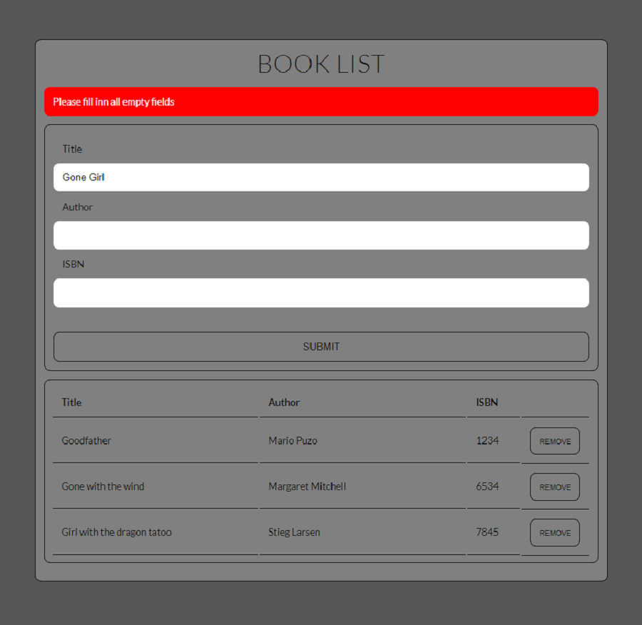

# Book List

Book List App in javascript. App is made for both mobile and desktop views. One can add new book or
removed already added from list. App also store all data at browser local storage. After adding
some books, it will be readed from local storage and displayed.

## Tools & Technology used

- Visual Studio Code
- JavaScript
- HTML 
- SASS
- flexbox
- local storage
